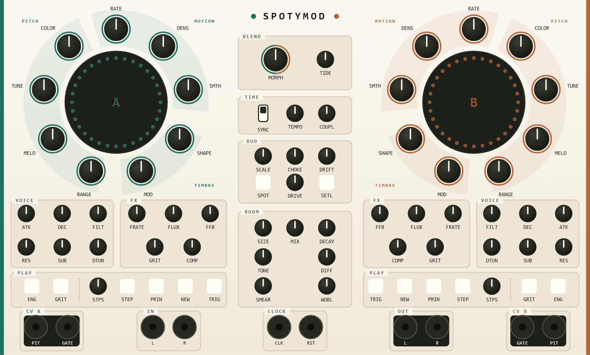
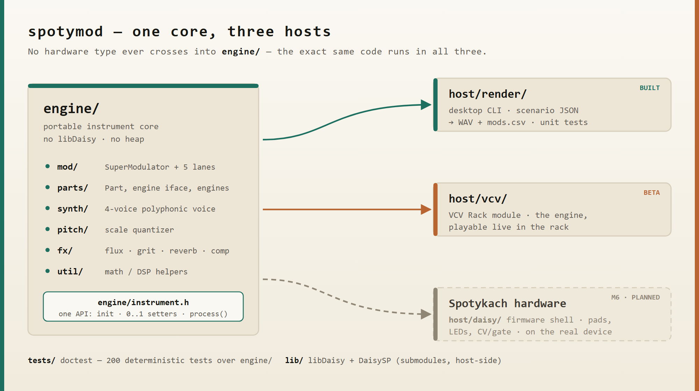

<p align="center">
  
</p>

# spotymod — modulation-first firmware for the Spotykach

Alternative firmware for the [Spotykach](https://synthux.academy/store/spotykach)
hardware, built around a single idea: **modulation is the instrument**. Two
symmetric parts, each driven by a performable modulation engine, feeding a
selectable sound source.

**spotymod** is a fork of [Synthux-Academy/Spotykach](https://github.com/Synthux-Academy/Spotykach)
(the official firmware). It reuses the original hardware drivers, clocking and
bootloader, and replaces the instrument core with a new modulation-first design.

> **⚠️ Not yet tested on real hardware.** The modulation engine currently exists
> only as a portable C++ core, verified with the desktop **offline renderer**
> (unit tests + audio/CV render). The firmware shell that runs it on the Daisy
> arrives in milestone M6 — until then, nothing here has been flashed to or run
> on an actual Spotykach device.

## What makes this fork different

The stock firmware is a granular sampler you modulate. This fork inverts that:
the **modulation system is the primary interface**, and the sound engine is
whatever you point it at.

Each part currently points at one of two: a **polyphonic synth voice**, or a
**granular texture deck** that granulates live input or a loaded sample. The
deck is deliberately not a second melodic instrument — it is the room the
synth part plays in. Both sit behind the same five modulation lanes and the
same voice row, so no knob goes dead when you flip the engine.

On the texture deck, **STEP** doesn't step a metronome grid — it walks a
`SliceMap` of transients marked as the buffer is recorded or loaded, so each
phrase fire spawns exactly one grain on a real attack in the material. MOTION
orders that walk at zero and scrambles it toward one, the same lane that
scatters the synth's melody now scattering which slice plays next. DENS caps
how far a roll can fill the tempo grid, biased by the slot's metric weight so
downbeats stay solid while the offs are free to roll. Material without enough
transients — a drone, a pad — falls back to the old even tempo grid
automatically, so nothing goes silent or errors out just because the source
has nothing to slice. FLOW is unchanged: it still LFOs continuously across
the same lanes regardless of engine.

Each of the two **parts** is a **SuperModulator** — one performable macro
surface (RATE, SHAPE, DENSITY, SMOOTH, RANGE, MOD) sitting on top of
**five independent modulation lanes**, one per target. Every lane has its own
phase, its own random stream and its own probability dice, running at a fixed
musical ratio of the master rate. Shared character, independent motion: the
melody can rise while the filter falls. (A single output driving all targets
would just move everything in unison — a tremolo, not an instrument.)

Each lane can run as a smooth LFO (**FLOW**), a stepped sequence (**STEP**), or
grow, loop, or erode over time (**ENTROPY**). A center section — **MORPH / COUPLE /
DRIFT / SPOT / SETTLE** — makes the interaction between the two parts playable, a
shared **Oliverb**-based ambient reverb turns the room into an instrument (Doppler
SIZE, a DECAY that blooms past 100 %), and CV + gate outputs extend the modulation
to the rest of the rack.

The full design intent lives in the residency's design spec; this README is a
self-contained summary of it.

## Architecture at a glance

One portable engine core, three hosts. No hardware type ever crosses into
`engine/`, so the exact same code runs in the desktop renderer, the VCV Rack
module, and (later) on the Spotykach itself.

<p align="center">
  
</p>

`Instrument` (`engine/instrument.h`) is the complete public API: `init(sample_rate)`,
normalized `0..1` parameter setters, and `process(in, out, size)`.

## Try it on the desktop (no hardware)

The engine is fully testable offline. You need a host C++ toolchain
(**clang** or gcc), **CMake**, and **Ninja**. doctest and nlohmann/json are
vendored under `third_party/`, so no test dependencies are fetched.

```bash
# optional: source a local env.sh to put your toolchain on PATH and set CC/CXX
source env.sh

cmake -S . -B build
cmake --build build
```

Run the unit tests:

```bash
ctest --test-dir build --output-on-failure
```

Render a scenario to audio + a modulation trace. A scenario is a JSON timeline
of parameter changes (see `host/render/scenarios/`):

```bash
./build/render.exe host/render/scenarios/demo_step_melody.json out.wav mods.csv
```

This writes:

- **`out.wav`** — the rendered audio.
- **`mods.csv`** — every lane's output plus pitch CV / gate per part, decimated
  for plotting. Ideal for *seeing* what FLOW / STEP / MELODY actually do.

`demo_step_melody` is a good starting point: a fixed 16-step melody that loops
identically, then varies (GROW) or regenerates into new motivic phrases (RENEW)
as MELODY is dialled off center — and cycles the phrase principle.

## Play it now — VCV Rack (beta)

For a hands-on feel of the concept there's a **VCV Rack module** (`host/vcv/`)
that runs the same engine as a live plugin — turn the knobs and hear the
modulation engine long before the M6 firmware. It's now a **beta**: a real,
playable Rack module and a permanent part of the workflow, not yet a finished
instrument.

**[Download the latest release](https://github.com/mcbronkowitch/spotymod/releases/latest)**
— `.vcvplugin` builds for Windows, Apple Silicon and Linux, currently **2.8.0**
(both engines, the texture deck included). Unpack into Rack's user plugin
directory and restart Rack.

Building it yourself needs its own toolchain (a native MinGW/GCC compiler, not
the desktop clang path); the build, install and I/O details live in
[`host/vcv/README.md`](host/vcv/README.md).

## Roadmap

| Milestone | Scope | Status |
|-----------|-------|--------|
| **M1** | Portable engine foundation: SuperModulator, five lanes, `Instrument` API, desktop render host + tests | ✅ done |
| **M1.6** | FX: per-part FLUX (tape echo) + GRIT (drive/reduce), shared ambient reverb, FX params as modulation targets | **done** (engine + host) |
| **M2** | Polyphonic synth voice (replaces the M1 test tone) | **done** (engine + host) |
| **M3** | Capture sequencer (freeze the PITCH lane into a loop) | **done** (engine + host) |
| **M4** | Center section — MORPH / COUPLE / DRIFT / SPOT / SETTLE | **done** (engine + host) |
| **M4.5** | Ambient reverb v2 — Oliverb port: Doppler SIZE, DECAY > 100 % bloom, TONE; shimmer & LGPL removed | **done** (engine + host) |
| **M4.6** | Dynamics — one-knob comp per part + master limiter w/ MASTER DRIVE | **done** (engine + host) |
| **M4.8** | Reverb dry/wet — equal-power MIX at the master join + clear-on-sleep CPU bypass | **done** (engine + host) |
| **M4.9** | Reverb DIFFUSION knob (replaces DEPTH) — room density 0–0.9, weak line-mod coupling | **done** (engine + host) |
| **M4.10** | Chord layer — COLOR knob, diatonic stacks, voice-leading, live FLOW surface | **done** (engine + hosts; hardware placement deferred) |
| **M5** | Sampler — the texture deck: a granular cloud as a second selectable part engine, live recording + overdub, WAV load/save, the Morphagene-style surface (GENE SIZE, ORGANIZE, SCAN, DENS, NEW) | **done** (engine + hosts, released in 2.8.0) |
| **CPU** | Three measured rounds on real hardware: `instrument_worst`'s worst block went from ~156 % of the audio-block budget to 94 %. Method and every number in [`bench/`](bench/README.md) and [`docs/bench/`](docs/bench/) | **done** (ongoing as a tool) |
| **M6** | Firmware shell: pads, gestures, panel, LEDs — runs on real hardware | planned |

Per-milestone detail and current status live in [`docs/roadmap.md`](docs/roadmap.md).

## Hardware (upstream firmware — arrives in M6)

> The build/flash steps below compile and flash the **original upstream
> firmware**, not the modulation-first engine. The new firmware shell that
> hosts `engine/` on the Daisy is milestone **M6** and is not wired up yet.

### Setup

Clone recursively, or run `git submodule update --init --recursive` to fetch the
submodules (libDaisy + DaisySP).

Note: the ws2812 driver requires a slight modification to libDaisy, so the
libDaisy submodule points at a specific branch within the bleeptools fork (based
on the Infrasonic Audio fork), which also carries a few MIDI and mpr121 changes.

### Compiling

Build the libraries once (a `Makefile` target is provided):

```bash
make -j8 libs
```

Then build the firmware:

```bash
make -j8
```

On success the binaries land in `build/`: `spotykach.bin` (flashed via DFU) and
`spotykach.elf` (for debugging).

### Flashing

The bootloader enables USB DFU updating from the **external** USB-C port on the
rear of the main PCB (not the one on the Seed).

1. Compile the firmware (above).
2. Connect the main PCB's USB-C port to the computer (a data-capable cable).
3. Hold `Reset` on the back of the unit for ~3 seconds — the bottom-pad LEDs
   start to "breathe" in white.
4. Run `make program-dfu`.

The device then boots the new firmware. A bad flash can temporarily "brick" the
unit and require reinstalling the bootloader, firmware, or both.

## License & credits

MIT — see [`LICENSE`](LICENSE) (Copyright © 2026 Synthux Academy, Bastian Tonk).
Bundled and submodule dependencies are documented in [`THIRD_PARTY.md`](THIRD_PARTY.md).
Original firmware credits are in [`CREDITS.md`](CREDITS.md).

Built with AI pair-programming — the **HAL 9000** co-author in the git history
is [Claude](https://www.anthropic.com/claude) (Anthropic). 🔴
